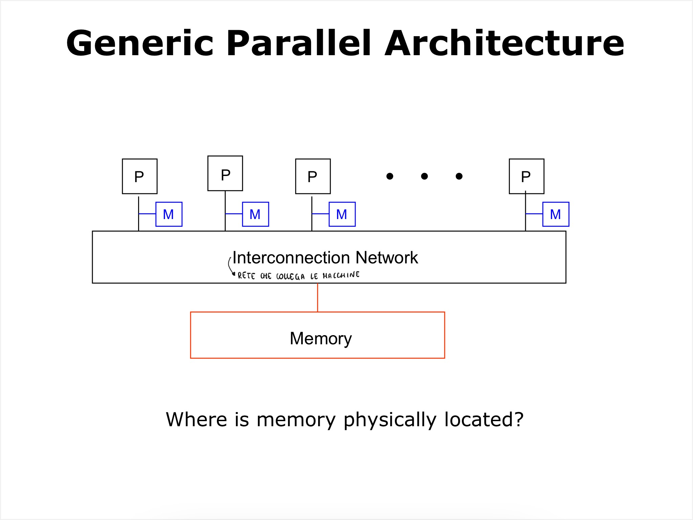

# Memoria

La memoria è un componente fondamentale di un calcolatore. La memoria è un dispositivo che permette di memorizzare dati e programmi. Possiamo individuare diversi tipi di memoria:

- **Memoria di massa**: memoria che contiene i dati e i programmi che non vengono eseguiti.
- **RAM**: memoria che contiene i dati e i programmi che vengono eseguiti.
- **Cache**: memoria che contiene i dati e i programmi che vengono eseguiti più frequentemente.

| Tipo di memoria  | Dimensione  | Velocità          |
| ---------------- | ----------- | ----------------- |
| Memoria di massa | multipli TB | centinaia di MB/s |
| RAM              | decine GB   | migliaia di GB/s  |
| Cache            | decine MB   | migliaia di TB/s  |

dati approssimativi\*

## Utilizzo della memoria in programmi paralleli

I programmi paralleli possono essere divisi in due categorie:

- **Memoria condivisa**
- **Memoria distribuita**

Possiamo dividere inoltre i tipi di accesso alla memoria in due categorie:

- **Uniform Memory Access**
- **Non Uniform Memory Access**

### Cache

La cache è una memoria molto veloce che contiene i dati che vengono utilizzati più frequentemente. La cache è la memoria più vicina al processore e viene utilizzata per ridurre il tempo di accesso alla memoria.

### Cache coherence

La cache coherence è un problema che si presenta quando più processori condividono la stessa memoria. Il problema è il seguente: se un processore modifica un dato in memoria, come faccio a far si che gli altri processori vedano la modifica?

Quando un processore accede alla memoria, la cache viene interrogata per verificare se il dato è presente. Se il dato è presente, il processore accede alla cache (cache hit), in caso contrario (cache miss), il processore deve accedere alla memoria. Quando un processore accede alla memoria, la cache viene aggiornata e il dato viene copiato nella cache.

Quando un processore vuole leggere una variabile, la linea di memoria che contiene la variabile viene copiata nella cache. Se un altro processore vuole leggere la stessa variabile, la linea di memoria che contiene la variabile viene copiata nella cache del secondo processore. Se il primo processore modifica la variabile, la linea di memoria che contiene la variabile viene aggiornata, ma la cache del secondo processore non viene aggiornata. Questo significa che il secondo processore **non** vede la modifica. Questo problema è chiamato **false sharing**.

Per risolvere questo problema, la cache deve essere interrogata ogni volta che un processore modifica un dato in memoria. Se la cache contiene il dato, la cache deve essere aggiornata. Questo processo è chiamato **cache coherence**. Ovviamente, questo processo rallenta l'esecuzione del programma.

## Conclusioni

- Abbiamo diversi tipi di memoria.
- La cache è una memoria molto veloce che contiene i dati che vengono utilizzati più frequentemente.
- La cache coherence è un processo che permette di mantenere la coerenza tra la cache e la memoria.
- Il false sharing è un problema che si presenta quando più processori utilizzano la loro cache per velocizzare l'accesso alla memoria.
- Mantenere la cache coherence è un processo che rallenta l'esecuzione del programma.
