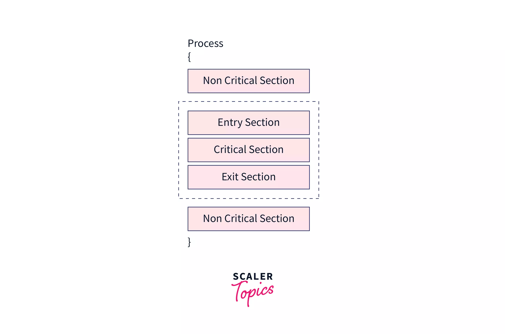

# Paradigmi

## Condivisione della memoria

Nelle macchine a memoria condivisa è importante sincronizzare i processi per evitare problemi di accesso alla memoria.

### Barriera

La barriera è un punto di sincronizzazione che permette di sincronizzare i processi. Blocca l'esecuzione di un processo fino a quando tutti i processi non hanno raggiunto la barriera. Quando un processo raggiunge la barriera viene **bloccato** fino a quando **tutti i processi** non hanno raggiunto la barriera.

Utilizzare la Barriera è molto semplice, ma può portare a dei tempi morti. Se un processo è molto veloce e gli altri processi sono molto lenti, il processo veloce deve aspettare che tutti i processi abbiano raggiunto la barriera.

### Lock

Il lock è utile quando vogliamo sincronizzare l'accesso a una risorsa condivisa. Il lock è una variabile che può assumere due valori: **libero** o **occupato**. Quando un processo vuole accedere alla risorsa, deve acquisire il lock. Se il lock è libero, il processo può accedere alla risorsa, altrimenti il processo deve aspettare che il lock sia libero. Quando il processo ha finito di utilizzare la risorsa, deve rilasciare il lock.

Questo significa che solamente un processo alla volta può accedere alla risorsa. Questo processo è chiamato **mutual exclusion**.

### Semaforo

Un semaforo è un meccanismo più generale rispetto ad un _mutex lock_ che può essere utilizzato per controllare l'accesso a una o più risorse. Un semaforo mantiene un conteggio delle risorse disponibili, e i thread possono acquisire o rilasciare risorse modificando questo conteggio. Se un thread cerca di acquisire una risorsa quando il conteggio del semaforo è zero (indicando che non ci sono risorse disponibili), il thread viene bloccato fino a quando una risorsa non diventa disponibile.

In sintesi, un lock è un caso speciale di semaforo che permette l'accesso esclusivo a una risorsa, mentre un semaforo può essere utilizzato per gestire l'accesso a un numero variabile di risorse.

### Sezione critica

La sezione critica è un termine usato in programmazione concorrente per indicare una porzione di codice che può essere eseguita da un solo thread o processo alla volta. Questa sezione di codice solitamente accede o modifica risorse condivise, come variabili globali o strutture di dati condivise.

L'accesso simultaneo a queste risorse da parte di più thread o processi può causare inconsistenze nei dati, quindi l'esecuzione della sezione critica deve essere gestita con cura.

e molto altro...

## Memoria distribuita

Nelle macchine a memoria distribuita non è necessario sincronizzare l'accesso alla memoria. Ogni processo ha la sua memoria e non può accedere alla memoria degli altri processi. Per condividere informazioni, i processi devono utilizzare un meccanismo di comunicazione.

Tutto è basato sulle direttive di comunicazione. Le direttive di comunicazione sono delle primitive che permettono ai processi di comunicare tra di loro, principalmente, `send` e `receive`.

### Comunicazione

I processi possono comunicare utilizzando due tipi di comunicazione:

- **Comunicazione sincrona**: il processo che invia un messaggio viene bloccato fino a quando il processo che riceve il messaggio non ha ricevuto il messaggio.
- **Comunicazione asincrona**: il processo che invia un messaggio non viene bloccato.

## Conclusioni

- Nelle macchine a memoria condivisa è necessario sincronizzare l'accesso alla memoria.
- Nelle macchine a memoria distribuita non è necessario sincronizzare l'accesso alla memoria.
- La sincronizzazione è un problema che si presenta quando più processi accedono alla memoria.
- Abbiamo diversi meccanismi di sincronizzazione: barriera, lock, semaforo, sezione critica.
- Le direttive di comunicazione sono delle primitive che permettono ai processi di comunicare tra di loro.
