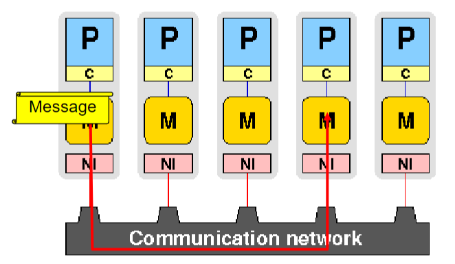
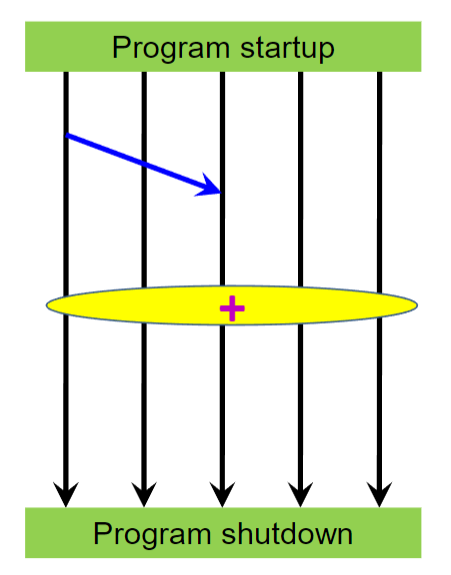
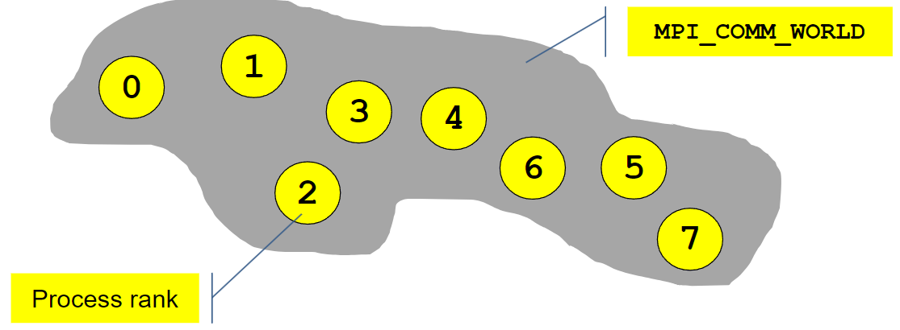

# Introduzione a MPI

## Paradigma di programmazione

Utilizzato principalmente su architetture a memoria distribuita. Ogni processore ha la propria memoria locale e non può accedere alla memoria degli altri processori. Per comunicare tra loro i processori devono scambiarsi **esplicitamente** dei messaggi attraverso la rete.



## MPI in poche parole

MPI è una libreria di funzioni che permette di scrivere programmi paralleli che girano su più processori. MPI è un'interfaccia standard, non un linguaggio di programmazione.

### Ciclo di vita di un programma MPI

1. Startup
   - lancia il programma su tutti i processori
   - stabilisce un contesto di comunicazione
2. Comunicazione
   - scambio di messaggi tra **coppie** di processori
3. Comunicazione collettiva
   - scambio di messaggi tra tutti i processori di un **sottogruppo**
   - Barrier, reduction, scatter, gather...
4. Shutdown



### Interfacce MPI

Headers:

```c++
#include <mpi.h>
```

Bindings:

```c++
error = MPI_Xxx(...);
```

Costanti:

tutte in maiuscolo, es. `MPI_COMM_WORLD`

Array:

tutti gli array sono indicizzati da 0 a n-1, dove n è la dimensione dell'array

### Inizializzazione

```c++
MPI_Init(int *argc, char ***argv);

// codice parallelo

MPI_Finalize();
```

Solo il master può continuare dopo MPI_Finalize().5

## MPI_Init()

Definisce un contesto di comunicazione `MPI_COMM_WORLD` che include tutti i processori che eseguono il programma.



Il comunicatore definisce un insieme di processori. Ogni processore ha un identificatore univoco `rank` che va da 0 a n-1, dove n è il numero totale di processori.

### Rank

Per ottenere il proprio rank:

```c++
int rank = MPI_Comm_rank(MPI_COMM_WORLD, &rank);
```

Per ottenere il numero totale di processori:

```c++
int size = MPI_Comm_size(MPI_COMM_WORLD, &size);
```

## World Hello World Hello World Hello

```c++
#include <mpi.h>

int main(int argc, char **argv){
    int rank, size;
    MPI_Init(&argc, &argv);
    MPI_Comm_rank(MPI_COMM_WORLD, &rank);
    MPI_Comm_size(MPI_COMM_WORLD, &size);

    if(rank % 2 == 0){
        printf("Hello from %d\n", rank);
    } else {
        printf("World from %d\n", rank);
    }

    MPI_Finalize();
    return 0;
}
```

### Installazione

Windows:

1. VSCode
   - C/C++ Extension Pack
   - clangd
2. cygwin64
   - gcc
     - assicurarsi di aggiungerlo a PATH
3. MS-MPI
   - SDK
   - Runtime

### Compilazione

`mpi.h` è un header, e deve essere trovato dal compilatore. Per compilare il programma:

```bash
gcc <file>.c -I %MSMPI_INC% -L %MSMPI_LIB64% -o <file>
```

### Esecuzione

```bash
mpiexec -np 4 ./hello
```

`-np 4` indica il numero di processori da utilizzare. `./hello` è il programma da eseguire

### Dettagli

Alcuni dettagli da notare:

- Dove/come sono inizializzati i processori?
- Dove va a finire l'output?

## Comunicazione punto a punto

- Chi sono i processori che inviano?
- Chi sono i processori che ricevono?
- Che tipo di dati vengono scambiati?
- Quanti dati vengono scambiati?

Mittente e destinatario devono essere specificati esplicitamente, e ognuno di loro deve passare le informazioni necessarie separatamente ad MPI.

### Comunicazione bloccante

Per una comunicazione bloccante, il mittente invia i dati e si blocca finché il destinatario non ha ricevuto i dati. Il destinatario si blocca finché non ha ricevuto i dati.

#### MPI_Send

```c++
int MPI_Send(void *buf, int count, MPI_Datatype datatype, int dest, int tag, MPI_Comm comm);
```

- `buf`: buffer contenente i dati da inviare
- `count`: numero di elementi da inviare
- `datatype`: tipo di dato da inviare
- `dest`: rank del destinatario
- `tag`: identificatore del messaggio (per distinguere messaggi diversi)
- `comm`: comunicatore

Quando la chiamata a `MPI_Send` ritorna, i dati nel buffer possono essere sovrascritti, e non si hanno garanzie sul destinatario.

#### MPI_Recv

```c++
int MPI_Recv(void *buf, int count, MPI_Datatype datatype, int source, int tag, MPI_Comm comm, MPI_Status *status);
```

- `buf`: buffer in cui salvare i dati ricevuti
- `count`: numero di elementi da ricevere
- `datatype`: tipo di dato da ricevere
- `source`: rank del mittente
- `tag`: identificatore del messaggio (per distinguere messaggi diversi)
- `comm`: comunicatore
- `status`: informazioni sul messaggio ricevuto

Una volta completata la chiamata, i dati nel buffer sono stati ricevuti e possono essere utilizzati.

#### Wildcard

`MPI_Recv` accetta anche valori speciali per `source` e `tag`:

- `source = MPI_ANY_SOURCE`: il messaggio può provenire da qualsiasi processore
- `tag = MPI_ANY_TAG`: il messaggio può avere qualsiasi tag

Le informazioni sul messaggio ricevuto sono salvate in `status` e possono essere recuperate come segue:

```c++
MPI_Status status;
MPI_Recv(..., &status);
int source = status.MPI_SOURCE;
int tag = status.MPI_TAG;

printf("Messaggio ricevuto da %d con tag %d\n", source, tag);
```

#### Lunghezza del messaggio

La lunghezza del messaggio può essere recuperata da `status`:

```c++
int MPI_Get_count(MPI_Status *status, MPI_Datatype datatype, int *count);
```

- `status`: informazioni sul messaggio ricevuto
- `datatype`: tipo di dato ricevuto
- `count`: numero di elementi ricevuti

```c++
int count;
MPI_Get_count(&status, MPI_INT, &count);
```

### Requisiti per la comunicazione punto a punto

- Il mittente deve specificare un destinatario valido
- Il destinatario deve specificare un mittente valido (o un wildcard)
- Il comunicatore deve includere sia mittente che destinatario (o `MPI_COMM_WORLD`)
- Il tag deve essere lo stesso per mittente e destinatario (o un wildcard)
- Il tipo di dato deve essere lo stesso per mittente e destinatario
- Il buffer del destinatario deve essere abbastanza grande per contenere i dati ricevuti

## Funzioni di utilità

| Funzione          | Descrizione                  |
| ----------------- | ---------------------------- |
| `MPI_Init()`      | Iniziamo                     |
| `MPI_Comm_size()` | Quanti siamo?                |
| `MPI_Comm_rank()` | Chi sono io?                 |
| `MPI_Send()`      | Invia a qualcuno             |
| `MPI_Recv()`      | Ricevi da qualcuno           |
| `MPI_Get_count()` | Quanti elementi ho ricevuto? |
| `MPI_Finalize()`  | Finiamo                      |

Per adesso non abbiamo ancora sinconizzato niente esplicitamente.

## Esempio: somma di array

Creare un array di n elementi e sommarli tutti. Ogni processore deve sommare una parte dell'array e inviare il risultato al master, che deve sommare i risultati parziali.

### Workflow

1. Inizializzazione di un array di n elementi sul master
2. Divisione dell'array in parti uguali
3. Somma parziale di ogni parte
4. Invio dei risultati parziali al master
5. Somma dei risultati parziali sul master
6. Stampa del risultato finale
7. Cleanup
