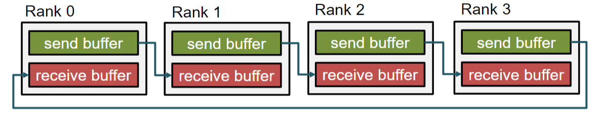
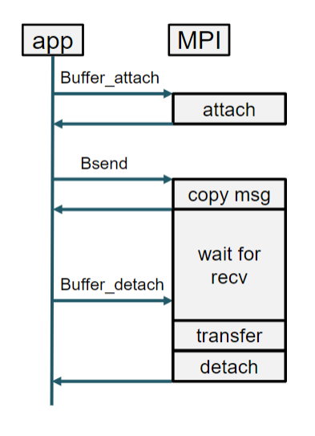
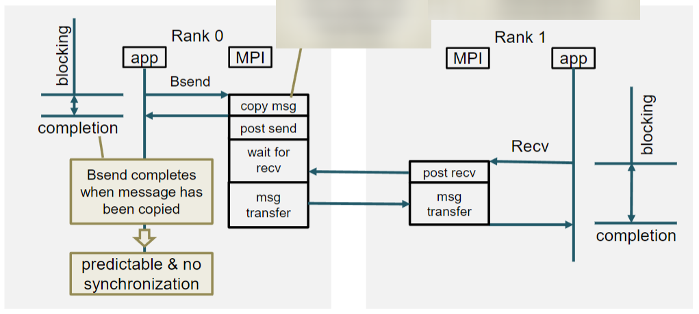
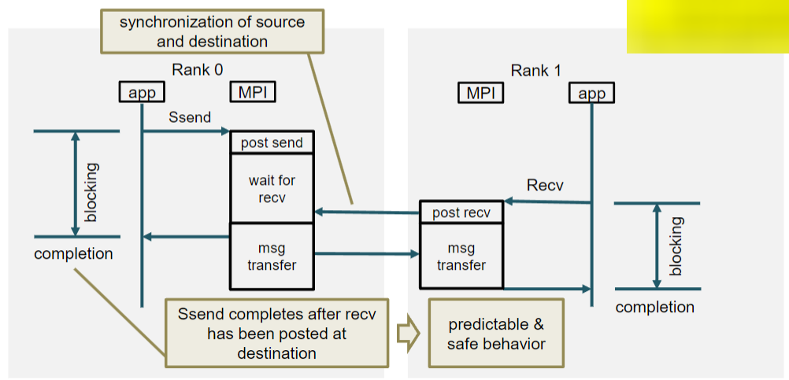
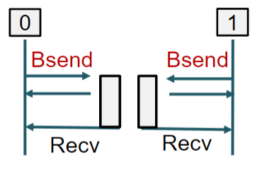
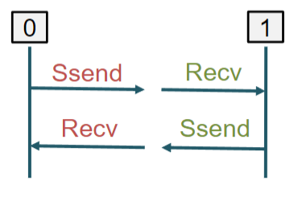
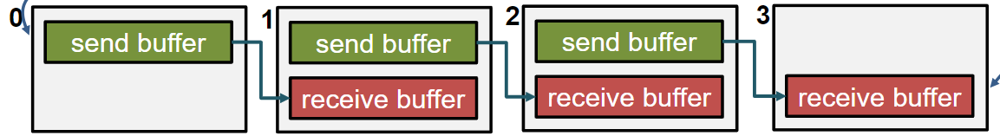
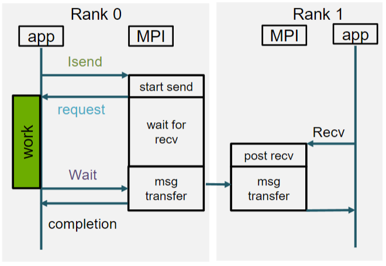

# Comunicazione Punto a Punto

## Bloccante

Un pattern molto frequente nel message passing è il Ring Shift. In questo pattern, ogni processo invia un messaggio al successivo, e riceve un messaggio dal precedente. Questo pattern evidenzia un problema delle funzioni `MPI_Send` e `MPI_Recv`. Vediamo un esempio:



```c++
// vicino di sinistra
int left = (rank - 1 + size) % size;
// vicino di destra
int right = (rank + 1) % size;

char* send = malloc(count *sizeof(char));
char* recv = malloc(count *sizeof(char));

MPI_Send(&send, 1, MPI_CHAR, right, count, MPI_COMM_WORLD);
MPI_Recv(&recv, 1, MPI_CHAR, left, count, MPI_COMM_WORLD, MPI_STATUS_IGNORE);
```

Il problema è che `MPI_Send` sceglie a runtime se inviare il messaggio in modo sincrono o asincrono. Se il messaggio è piccolo, viene inviato in modo sincrono, altrimenti in modo asincrono. Questo significa che se il messaggio è grande, il processo che invia il messaggio si blocca fino a che il processo destinatario non ha ricevuto il messaggio. Questo è un problema perché il processo destinatario non può ricevere il messaggio finché non ha inviato il suo messaggio, e così via. Questo è un deadlock. Per risolvere questo problema basta non usare `MPI_Send`.

### Alternative a MPI_Send

MPI fornisce due alternative (bloccanti) a `MPI_Send`:

- `MPI_Ssend`
  - `S` sta per sincrono
  - Completa solo quando il destinatario ha **iniziato** la ricezione
  - Handshake
- `MPI_Bsend`
  - `B` sta per buffered
  - Va sempre a buon fine
  - Usa un buffer interno
  - Sincrona solo nella **copia del messaggio** nel buffer
  - Asincrona dopo la copia

### Differenze nel Punto a Punto Bloccante

| Funzione    | Tipo                | Completamento                     |
| ----------- | ------------------- | --------------------------------- |
| `MPI_Send`  | Sincrona o Buffered | Dipende dal messaggio             |
| `MPI_Ssend` | Sincrona            | Il destinatario inizia a ricevere |
| `MPI_Bsend` | Buffered            | Il messaggio è copiato nel buffer |
| `MPI_Recv`  | ---                 | Il messaggio è stato ricevuto     |

#### Buffered Send

Per usare `MPI_Bsend` bisogna prima inizializzare il buffer con `MPI_Buffer_attach`. Per inviare il messaggio bisogna usare `MPI_Bsend` e per completare l'invio bisogna usare `MPI_Buffer_detach`.



```c++
int size = MPI_Pack_size(count, datatype, MPI_COMM_WORLD);
size += MPI_BSEND_OVERHEAD;

MPI_Buffer_attach(buffer, size);

MPI_Bsend(&send, 1, MPI_CHAR, right, count, MPI_COMM_WORLD);

MPI_Buffer_detach(&buffer, &size);
```



#### Syncronous Send

`MPI_Ssend` è una versione sincrona di `MPI_Send`. Questa funzione è bloccante e completa solo quando il destinatario ha iniziato a ricevere il messaggio. Questo è un esempio di handshake.



### Soluzione al Deadlock

| Buffered                              | Sincrona                            |
| ------------------------------------- | ----------------------------------- |
|  |  |
| il buffer si occupa dell'ordine       | l'ordine di esecuzione è esplicito  |

#### Buffered

```c++
int dst;
if (rank == 0) dst = 1;
else dst = 0;

char *buffer = malloc(count * sizeof(char));

int size = MPI_Pack_size(count, datatype, MPI_COMM_WORLD, &size);
size += MPI_BSEND_OVERHEAD;

MPI_Buffer_attach(buffer, size);
MPI_Bsend(&send, 1, MPI_CHAR, dst, count, MPI_COMM_WORLD);
MPI_Buffer_detach(&buffer, &size);

MPI_Recv(&recv, 1, MPI_CHAR, dst, count, MPI_COMM_WORLD, MPI_STATUS_IGNORE);
```

#### Sincrona

```c++
int dst;
if (rank == 0) dst = 1;
else dst = 0;

char *buffer = malloc(count * sizeof(char));

if(rank == 0){
  MPI_Ssend(&buffer, count, MPI_CHAR, 1, 0, MPI_COMM_WORLD);
  MPI_Recv(&buffer, count, MPI_CHAR, 1, 0, MPI_COMM_WORLD, MPI_STATUS_IGNORE);
} else {
  MPI_Recv(&buffer, count, MPI_CHAR, 0, 0, MPI_COMM_WORLD, MPI_STATUS_IGNORE);
  MPI_Ssend(&buffer, count, MPI_CHAR, 0, 0, MPI_COMM_WORLD);
}
```

### MPI_Sendrecv

`MPI_Sendrecv` è una funzione che permette di inviare e ricevere un messaggio in un'unica chiamata. Questa funzione è bloccante e completa solo quando il messaggio è stato inviato e ricevuto.

Possiamo usare una _wildcard_ per indicare che non ci interessa il mittente o il destinatario. In questo caso, l'operazione non viene effettuata.

Per esempio, modificando il ring shift facendo in modo che P0 non riceva il messaggio da P3, possiamo usare una wildcard per saltare la ricezione (viceversa per P3).



```c++
int left = rank - 1;
int right = rank + 1;

if (left < 0) left = MPI_PROC_NULL;
if (right >= size) right = MPI_PROC_NULL;

MPI_Sendrecv(
  &send_buff, snd_sz, MPI_CHAR, right, send_tag,
  &recv_buff, rcv_sz, MPI_CHAR, left, rec_tag,
  MPI_COMM_WORLD, MPI_STATUS_IGNORE);
```

### MPI_Sendrecv_replace

Tutta la comunicazione avviene tramite un solo buffer (non lo vediamo in dettaglio).


### Riassunto Punto a Punto Bloccante

- Comunicazione MPI bloccante
  - L'operazione termina **LOCALMENTE** quando la funzione ritorna
  - Dopo il completamento, il buffer può essere riutilizzato
- Modalità di Send
  1. `MPI_Ssend`
     - Serve un handshake
     - Più lenta
     - Possibilità di deadlock
  2. `MPI_Bsend`
     - Completa quando il sender ha copiato il messaggio nel buffer
     - L'user deve fornire il buffer (attach/detach)
     - Operazioni di copia (performance ridotte)
  3. `MPI_Send`
     - Dipende dalla dimensione del messaggio
     - Sincrona o Buffered
     - Minor controllo

## Non Bloccante

Le opportunità che offre il modello di comunicazione non bloccante sono:

- Evitare il deadlock
- Comunicazione bidirezionale
- Evitare tempi di attesa
- Evitare la sincronizzazione
- Overlap di comunicazione e computazioni



### Funzioni Standard non bloccanti

`MPI_Isend` e `MPI_Irecv` sono le funzioni standard non bloccanti. Sono simili alle loro controparti bloccanti ma non bloccano il processo. Queste funzioni ritornano immediatamente, anche se il messaggio non è stato inviato o ricevuto. Introducono un nuovo oggetto: la richiesta.

```c++
MPI_Request send_request, recv_request;
MPI_Isend(&send, 1, MPI_INT, dest, tag, MPI_COMM_WORLD, &send_request);
MPI_Irecv(&recv, 1, MPI_INT, source, tag, MPI_COMM_WORLD, &recv_request);
```

E' importante **non modificare il buffer** finché la richiesta non è stata completata. Il ritorno della funzione non garantisce il completamento dell'operazione.

### Differenze nel Punto a Punto Non Bloccante

| Funzione     | Tipo                | Completamento                     |
| ------------ | ------------------- | --------------------------------- |
| `MPI_Isend`  | Sincrona o Buffered | Dipende dal messaggio             |
| `MPI_Issend` | Sincrona            | Il destinatario inizia a ricevere |
| `MPI_Ibsend` | Buffered            | Il messaggio è copiato nel buffer |
| `MPI_Irecv`  | ---                 | Il messaggio è stato ricevuto     |

### Testare il Completamento

Per testare il completamento di una richiesta possiamo usare `MPI_Test` o `MPI_Wait`. `MPI_Test` ritorna `true` se la richiesta è stata completata, `false` altrimenti. `MPI_Wait` blocca il processo finché la richiesta non è stata completata.
In un certo senso, abbiamo 2 tipi di test:

- Bloccante: `MPI_Wait`
- Non bloccante: `MPI_Test`

Nonostante la nomenclatura, entrambe le modalità si riferiscono alla comunicazione punto-punto non bloccante.

### Testare il Completamento

#### Bloccante

```c++
MPI_Wait(&send_request, &status);
```

#### Non Bloccante

```c++
MPI_Test(&send_request, &flag, &status);
```

dove:

- `send_request` è la richiesta
- `flag` è un `int` che indica se la richiesta è stata completata
- `status` è un oggetto che contiene informazioni sul completamento

### Esempio Wait

```c++
MPI_Request request;
MPI_Status status;

MPI_Isend(&send_buff, count, MPI_INT, dest, tag, MPI_COMM_WORLD, &request);

// lavoro
// non usare send_buff

MPI_Wait(&request, &status);

// ora è possibile usare send_buff
```

### Esempio Test

```c++
MPI_Request request;
MPI_Status status;
int flag;

MPI_Isend(&send_buff, count, MPI_INT, dest, tag, MPI_COMM_WORLD, &request);

do {
  // lavoro
  // non usare send_buff

  MPI_Test(&request, &flag, &status);
} while (!flag);

// ora è possibile usare send_buff
```

### Controllare il Completamento di più richieste

`MPI_Waitall` e `MPI_Testall` permettono di controllare il completamento di più richieste.

```c++
int num_requests = 2;
MPI_Request requests[num_requests];
MPI_Status statuses[num_requests];

MPI_Isend(&send_buff, count, MPI_INT, dest, tag, MPI_COMM_WORLD, &requests[0]);
MPI_Irecv(&recv_buff, count, MPI_INT, source, tag, MPI_COMM_WORLD, &requests[1]);

// lavoro

MPI_Waitall(num_requests, requests, statuses);
```

### Controllare il Completamento di più richieste (2)

E' possibile controllare il completamento di **esattamente 1** richiesta su molte.

```c++
MPI_Waitany(int count, MPI_Request requests[], int* index, MPI_Status *status);

MPI_Testany(int count, MPI_Request requests[], int* index, int* flag, MPI_Status *status);
```

Nel caso di `Testany`, `flag` è un `int` che indica se una richiesta è stata completata. Dato che `Testany` ritorna immediatamente, `index` è valido solo se `flag` è `true`.

### Controllare il Completamento di più richieste (3)

E' possibile controllare il completamento di **almeno 1** richiesta su molte.

```c++
MPI_Waitsome(int incount, MPI_Request requests[], int* outcount, int indices[], MPI_Status statuses[]);

MPI_Testsome(int incount, MPI_Request requests[], int* outcount, int indices[], MPI_Status statuses[]);
```

`outcount` è un `int` che indica il numero di richieste completate. `indices` è un array di `int` che contiene gli indici delle richieste completate. Ha quindi la stessa funzione di `flag` in `Testany`.

### Esempio Testany

```c++
MPI_Request requests[2];
MPI_Status status;
int finished = 0;

MPI_Isend(&send_buff, count, MPI_INT, dest, tag, MPI_COMM_WORLD, &requests[0]);
MPI_Irecv(&recv_buff, count, MPI_INT, source, tag, MPI_COMM_WORLD, &requests[1]);

do {
  // lavoro
  // non usare send_buff

  MPI_Testany(2, requests, &index, &flag, &status);
  if (flag) finished++;

} while (finished < 2);
```

Le richieste completate vengono impostate automaticamente a `MPI_REQUEST_NULL`.

### Riassunto Punto a Punto Non Bloccante

- Send e Recv non bloccanti standard
  - Il ritorno della funzione non garantisce il completamento dell'operazione
  - Usare `MPI_Wait*` o `MPI_Test*` per controllare il completamento usando i request handles
- Tutte le richieste devono essere completate
- Potenzialità
  - Overlap di comunicazione e computazione (non garantite dallo standard)
  - Overlap di send e recv
  - Evitare sincronizzazione e tempi di morti
