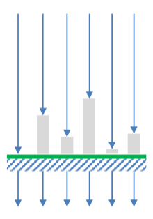
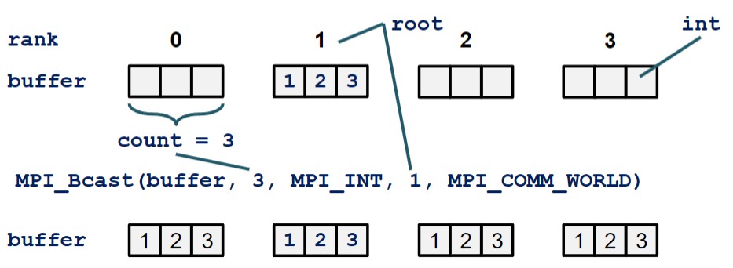
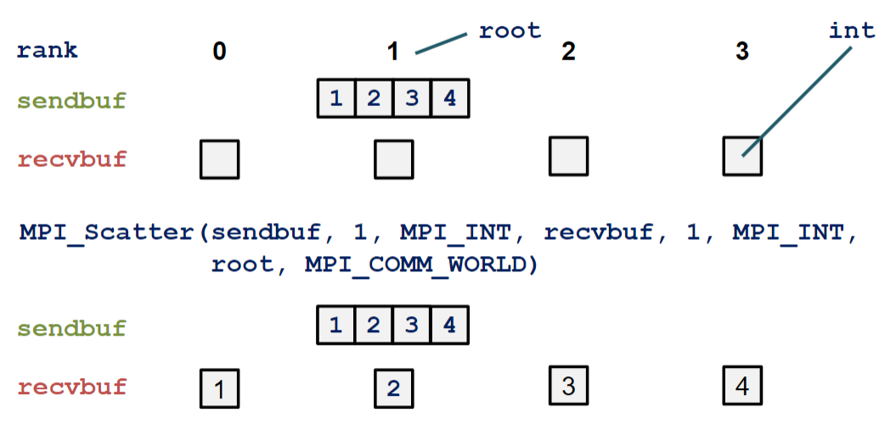
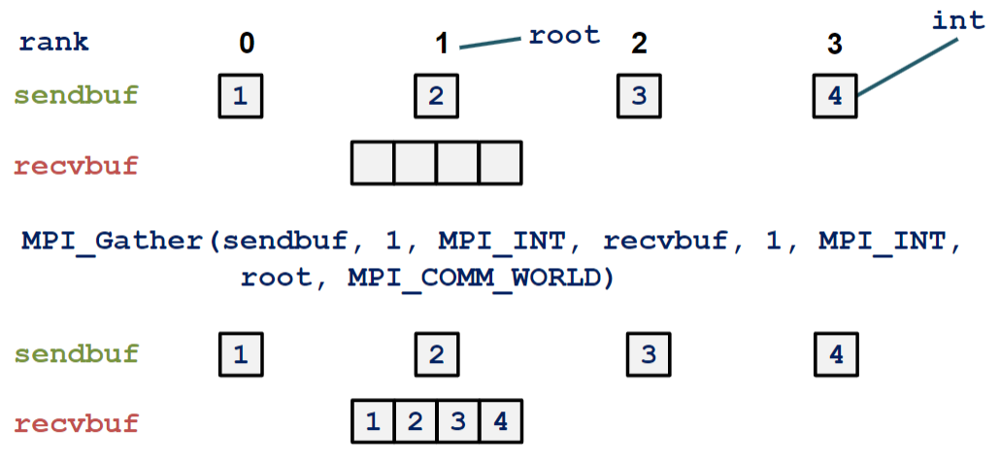
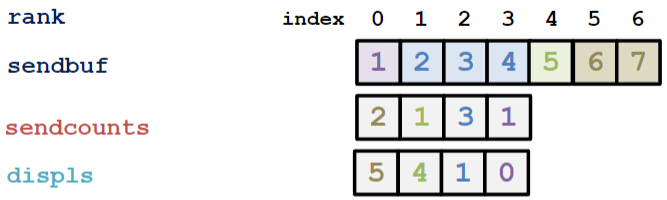
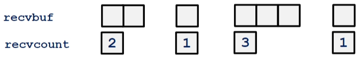
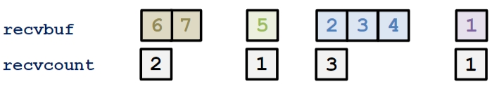
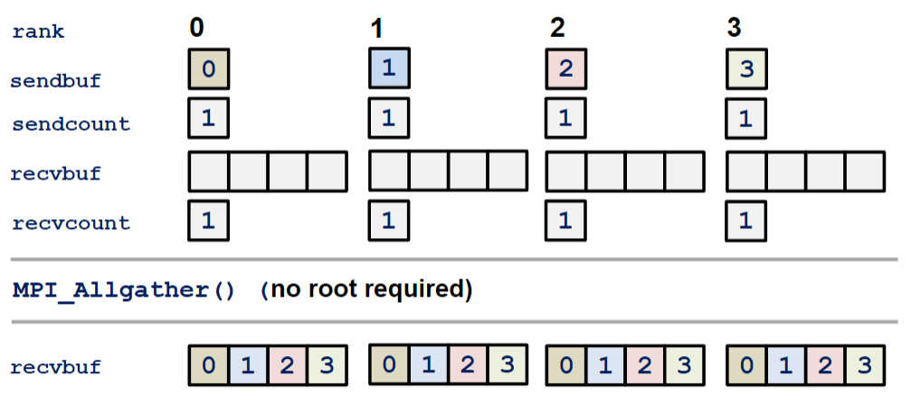
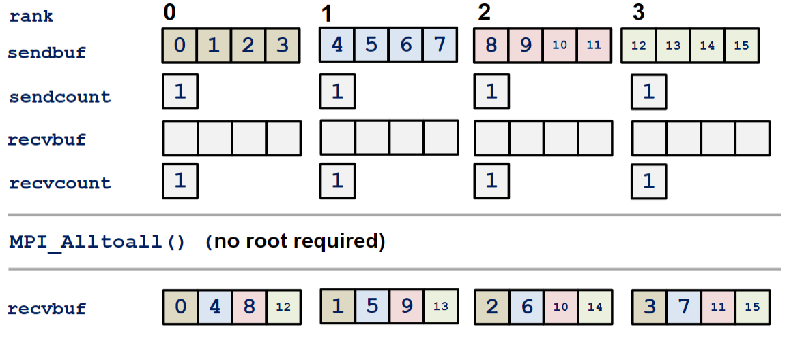
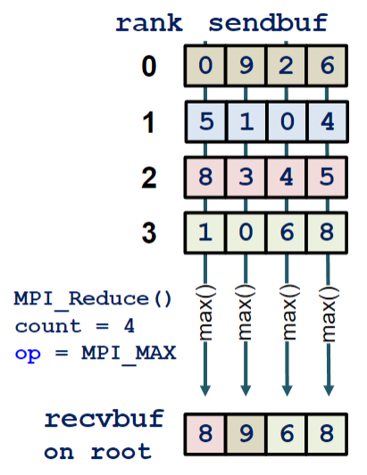

# Comunicazione Collettiva

## Cos'è la comunicazione collettiva?

La comunicazione collettiva è un mezzo di comunicazione che permette di inviare un messaggio a tutti i processori di un gruppo. Per fare ciò, tutti i processori devono chiamare la stessa funzione di comunicazione collettiva, e come le altre funzioni di comunicazione, anche questa esiste in varianti `Blocking` e `Non-Blocking`.

### Regole per la comunicazione

- Il tipo di dati deve coincidere
- Non è possibile impostare i tag
- Il numero di elementi deve essere lo stesso per tutti i processori

### Tipi di comunicazione

- Sincronizzazione: `Barrier`
- Movimento di dati
- Computazione collettiva
- Combinazioni di dati e computazione

## Barrier

La funzione `MPI_Barrier` permette di sincronizzare tutti i processori di un gruppo. La funzione blocca l'esecuzione di tutti i processori fino a quando tutti non hanno raggiunto la funzione.

```c
int MPI_Barrier(MPI_Comm comm);
```



## Broadcast

La funzione `MPI_Bcast` permette di inviare un messaggio da un processore a tutti gli altri processori di un gruppo.

```c
MPI_Bcast(void *buffer, int count, MPI_Datatype datatype, int root, MPI_Comm comm);
```

- `buffer`: buffer di invio/ricezione
- `count`: numero di elementi da inviare
- `datatype`: tipo di dato
- `root`: processore che invia il messaggio
- `comm`: comunicatore



## Scatter

La funzione `MPI_Scatter` permette di inviare un messaggio da un processore a tutti gli altri processori di un gruppo, ma in questo caso il messaggio viene diviso in parti uguali e inviato a tutti i processori.

```c
MPI_Scatter(void *sendbuf, int sendcount, MPI_Datatype sendtype,
			void *recvbuf, int recvcount, MPI_Datatype recvtype,
			int root, MPI_Comm comm);
```



## Gather

La funzione `MPI_Gather` permette di inviare un messaggio da tutti i processori di un gruppo ad un processore. Posiziona i messaggi ricevuti in un unico buffer, in ordine di rank.

Practicamente è l'opposto di `MPI_Scatter`.

```c
MPI_Gather(	void *sendbuf, int sendcount, MPI_Datatype sendtype,
			void *recvbuf, int recvcount, MPI_Datatype recvtype,
			int root, MPI_Comm comm);
```



## Scatterv

La funzione `MPI_Scatterv` permette di inviare un messaggio da un processore a tutti gli altri processori di un gruppo, ma in questo caso il messaggio può essere diviso in parti di dimensioni diverse e inviato a tutti i processori.

```c
MPI_Scatterv(	void *sendbuf, int *sendcounts, int *displs, MPI_Datatype sendtype,
				void *recvbuf, int recvcount, MPI_Datatype recvtype,
				int root, MPI_Comm comm);
```

- `sendcounts`: array che contiene il numero di elementi da inviare a ciascun processore
  - `sendcounts[i]`: numero di elementi da inviare al processore `i`
- `displs`: array che contiene gli offset dei dati da inviare a ciascun processore specificato in numero di elementi
  - `displs[i]`: offset dei dati da inviare al processore `i`





In questo esempio, il rank 1 invia a tutti gli altri rank una porzione del buffer. Più in dettaglio:

Sendcounts:

- `Rank 0` riceve **2** elementi
- `Rank 1` riceve **1** elemento (invia a se stesso)
- `Rank 2` riceve **3** elementi
- `Rank 3` riceve **1** elemento

Displacements:

- Rank `0` ricevera gli elementi a partire dall'indice **5**
  - quindi riceverà gli elementi buf[5] e buf[6]
- Rank `1` ricevera gli elementi a partire dall'indice **4**
  - quindi riceverà l'elemento buf[4]
- ...

Ovviamente ogni rank deve conoscere il numero di elementi che riceverà e di conseguenza dovrà allocare un buffer di dimensione adeguata.

## Gatherv

Esiste anche una funzione `MPI_Gatherv` che è l'opposto di `MPI_Scatterv`.

## Allgather

Combina `MPI_Gather` e `MPI_Bcast`. Ogni processore invia un messaggio a tutti gli altri processori.

```c
MPI_Allgather(	void *sendbuf, int sendcount, MPI_Datatype sendtype,
				void *recvbuf, int recvcount, MPI_Datatype recvtype,
				MPI_Comm comm);
```



### Perché usare `MPI_Allgather` rispetto a `MPI_Gather` e `MPI_Bcast`?

- La libreria MPI può ottimizzare la comunicazione
- Assunzione generale: La comunicazione è più veloce se tutti i processori comunicano allo stesso tempo

## Alltoall

La funzione `MPI_Alltoall` permette di inviare l'i-esimo elemento di ogni processore al processore i-esimo.

```c
MPI_Alltoall(	void *sendbuf, int sendcount, MPI_Datatype sendtype,
				void *recvbuf, int recvcount, MPI_Datatype recvtype,
				MPI_Comm comm);
```



## Computazione collettiva

La computazione collettiva è un'operazione che coinvolge tutti i processori di un gruppo. Permette di eseguire operazioni localmente e poi combinare i risultati in un unico risultato nel processore `root`.

## Reduce

La funzione `MPI_Reduce` permette di eseguire un'operazione su dati distribuiti.

```c
MPI_Reduce(	void *sendbuf, void *recvbuf, int count, MPI_Datatype datatype,
			MPI_Op op, int root, MPI_Comm comm);
```

L'operazione viene eseguita su tutti i `count` elementi di `sendbuf` e il risultato viene memorizzato in `recvbuf` solo sul root. Se tutti i processori necessitano del risultato, allora è possibile usare `MPI_Allreduce`.



Sono disponibili diverse operazioni:

- `MPI_SUM`: Somma
- `MPI_PROD`: Prodotto
- `MPI_MAX`: Massimo
- `MPI_MIN`: Minimo
- ...

C'è anche la possibilità di definire una propria operazione, usando `MPI_Op_create`.

> **Nota**: `MPI_Reduce` assume che l'operazione sia associativa.

### In_place

Alcune funzioni di comunicazione permettono di specificare `MPI_IN_PLACE` come buffer di invio. In questo caso il buffer di invio è lo stesso del buffer di ricezione. Questo permette di risparmiare memoria, ma i dati originali vengono sovrascritti.

| Funzione      | Argomento MPI_IN_PLACE | rank  |
| ------------- | ---------------------- | ----- |
| `Gather()`    | send_buff              | root  |
| `Scatter()`   | recv_buff              | root  |
| `Allgather()` | send_buff              | tutti |
| `Alltoall()`  | send_buff              | tutti |
| `Reduce()`    | send_buff              | root  |
| `Allreduce()` | send_buff              | tutti |

## Riassunto

- MPI fornisce un'ampia gamma di funzioni di comunicazione collettiva
- Le funzioni di comunicazione collettiva permettono di inviare messaggi a tutti i processori di un gruppo
- Tutti i processori devono chiamare la stessa funzione di comunicazione collettiva
- Le funzioni di comunicazione collettiva possono essere usate per sincronizzare i processori, per spostare dati o per eseguire computazioni collettive
- E' sempre meglio usare le funzioni di comunicazione collettiva rispetto a usare le funzioni di comunicazione elementare per emulare le funzioni collettive
  - AllGather vs Gather + Bcast
- Conviene **non** utilizzare contemporaneamente le funzioni di comunicazione collettiva e quelle punto a punto
