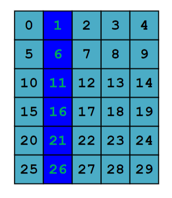
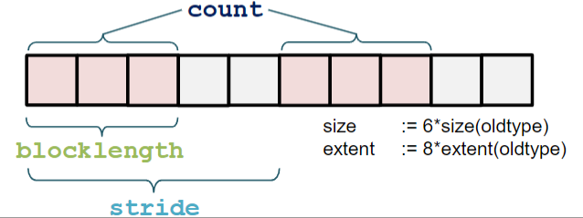
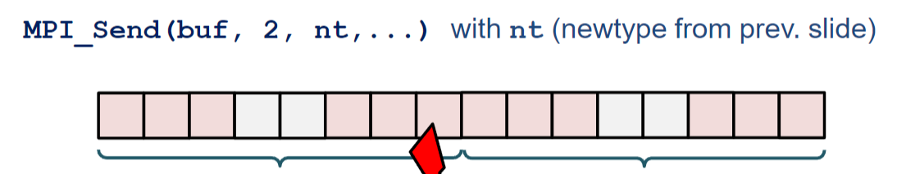
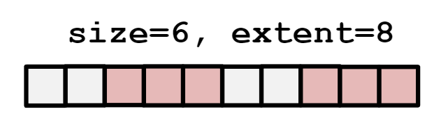
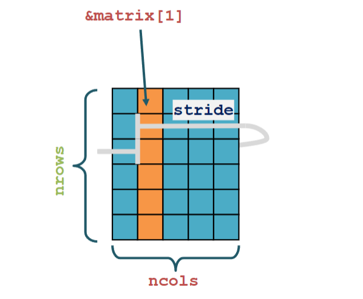
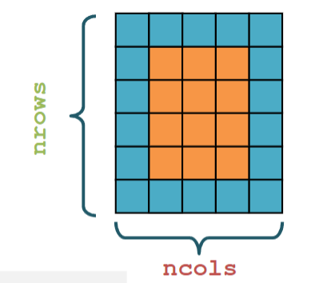
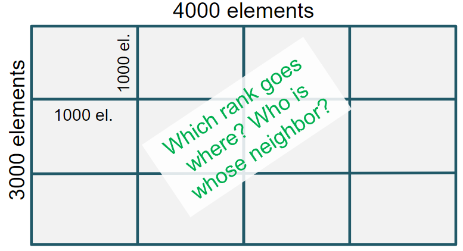
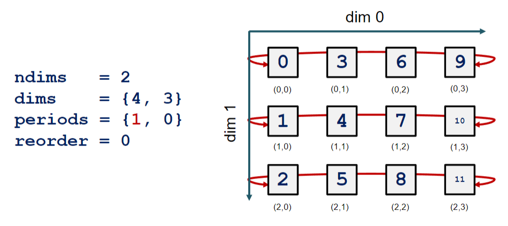
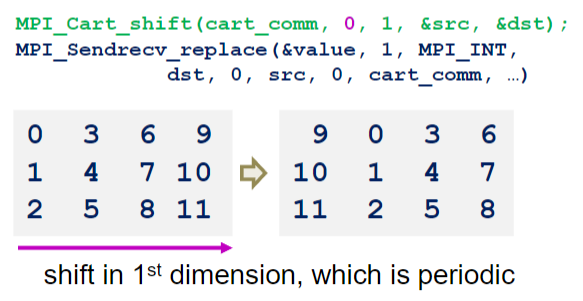
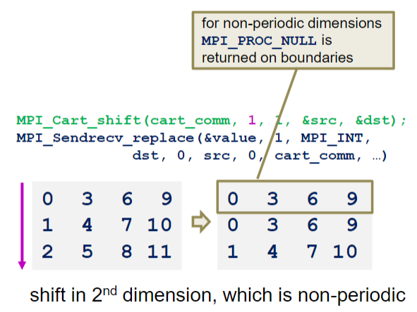

# Dati, Topologie, Performance

## Dati Derivati

MPI fornisce la possibilità di creare nuovi tipi di dati derivati da quelli base. Questi tipi di dati possono essere usati per inviare messaggi di dati strutturati.

```c++
// root: legge un dato di conifgurazione da file e lo salva in un oggetto di tipo Config

MPI_Bcast(&cfg.nx, 1, MPI_INT, ...);
MPI_Bcast(&cfg.ny, 1, MPI_INT, ...);
MPI_Bcast(&cfg.nz, 1, MPI_DOUBLE, ...);
MPI_Bcast(&cfg.nsteps, 1, MPI_INT, ...);
.
.
.
```

Sarebbe molto più comodo inviare un unico messaggio contenente tutti i dati di configurazione.

```c++
MPI_Bcast(&cfg, 1, <tipo_di_cfg>, ...);
```

## Perché usare tipi derivati?

Partiamo con un esempio. Inviare una colonna di una matrice. In `C`, le matrici salvano le righe in modo contiguo in memoria. Quindi, per inviare una colonna, dobbiamo inviare un blocco di memoria non contiguo.



## Come fare?

Ci sono tre step da seguire:

1. Costruire un tipo di dato derivato con `MPI_Type_*();`
2. _Committare_ il nuovo tipo di dato con `MPI_Type_commit();`
3. Deallocazione del tipo di dato con `MPI_Type_free();`

Tutte le chiamate di tipo derivato sono locali.

## MPI_Type_vector

```c++
MPI_Type_vector(int count, int blocklength, int stride, MPI_Datatype oldtype, MPI_Datatype *newtype);
```

- `count`: numero di blocchi
- `blocklength`: numero di elementi per blocco
- `stride`: numero di elementi tra l'inizio di un blocco e l'inizio del successivo
- `oldtype`: tipo di dato base

### Esempio

```c++
MPI_Datatype newtype;
MPI_Type_vector(3, 2, 4, MPI_INT, &newtype);

MPI_Type_commit(&newtype);
// si può usare newtype

MPI_Type_free(&newtype);
```



> **Nota**: Importante evitare concatenare più chiamate di tipo derivato. È meglio creare un tipo di dato derivato che contiene tutti i dati necessari.



> in questo caso manca il "gap" tra i 2 blocchi, che potrebbe essere un problema.

## Dimensioni

Per ottenere le dimensioni di un tipo di dato derivato possiamo usare `MPI_Type_size()`.

```c++
int MPI_Type_size(MPI_Datatype datatype, int *size);
```

Per ottenere l'estensione di un tipo di dato derivato possiamo usare `MPI_Type_extent()`.

```c++
int MPI_Type_get_extent(MPI_Datatype datatype, MPI_Aint *extent);
```

L'estensione è la dimensione totale del tipo di dato, compresi i gap.



## Inviare una Colonna

Le matrici sono salvate in modo contiguo in memoria. Per inviare una singola colonna dobbiamo gestire il count e lo stride.



```c++
double matrix[30];
MPI_Datatype coltype;

// count = nrows, blocklength = 1, stride = ncols
MPI_Type_vector(nrows, 1, ncols, MPI_DOUBLE, &coltype);
MPI_Type_commit(&coltype);

MPI_Send(&matrix[0], 1, coltype, ...);

MPI_Type_free(&coltype);
```

## Inviare una Sottomatrice

Inviare una sottomatrice è molto utile per parallelizzare l'elaborazione di una matrice (es. Automi Cellulari).

Si può usare `MPI_Type_create_subarray()`.



```c++
MPI_Type_create_subarray(int ndims, int array_of_sizes[], int array_of_subsizes[], int array_of_starts[], int order, MPI_Datatype oldtype, MPI_Datatype* newtype);
```

- `ndims`: dimensione della matrice
- `array_of_sizes`: array con le dimensioni della matrice
- `array_of_subsizes`: array con le dimensioni della sottomatrice
- `array_of_starts`: array con gli indici di partenza della sottomatrice
- `order`: `MPI_ORDER_C` o `MPI_ORDER_FORTRAN`
  - `MPI_ORDER_C`: row-major order
  - `MPI_ORDER_FORTRAN`: column-major order

## Esempio

| Parametro  | Valore             | Nota |
| ---------- | ------------------ | ---- |
| `dims`     | 2                  |      |
| `arr_size` | {nrows, ncols}     |      |
| `sub_size` | {nrows-2, ncols-2} | $^1$ |
| `starts`   | {1, 1}             | $^2$ |
| `order`    | MPI_ORDER_C        |      |
| `oldtype`  | MPI_INT            |      |

$^1$ La sottomatrice è più piccola di 2 righe e 2 colonne rispetto alla matrice originale.  
$^2$ La sottomatrice inizia dalla riga 1 e dalla colonna 1.

## Creare nuove topologie

MPI fornisce la possibilità di creare nuove topologie di comunicazione. La topologia di default è quella lineare, dove ogni processo ha un solo vicino a destra e uno a sinistra. Questa topologia è molto limitante. Non è necessario che i processi siano disposti in modo lineare. Possiamo creare topologie più complesse, come ad esempio una topologia ad anello o una topologia a griglia.

## Esempio di topologia

Immaginiamo di avere una matrice e di volerla suddividere in blocchi di dimensione `n` per `n`. Possiamo creare una topologia a griglia, dove ogni processo ha 4 vicini: sopra, sotto, destra e sinistra.



Dobbiamo mappare la topologia a griglia con la topologia di default. Per fare ciò possiamo evitare di creare una nuova topologia e usare la topologia di default, ma il processo di mappatura sarebbe molto complicato. È meglio creare una nuova topologia.

## MPI_Cart_create

```c++
MPI_Cart_create(MPI_Comm comm_old, int ndims, int dims[], int periods[], int reorder, MPI_Comm *comm_cart);
```

- `comm_old`: comunicatore dal quale vogliamo creare la nuova topologia
- `ndims`: numero di dimensioni della topologia
- `dims`: array di `ndims` elementi che contiene il numero di processi per ogni dimensione
- `periods`: array di `ndims` elementi che contiene il periodo per ogni dimensione
  - `0`: non periodico
  - `1`: periodico
- `reorder`: `0` o `1`
  - `0`: non permette di riordinare i processi
  - `1`: permette di riordinare i processi
- `comm_cart`: comunicatore della nuova topologia



## Funzioni di utilità

| Funzione            | Descrizione                  |
| ------------------- | ---------------------------- |
| `MPI_Comm_rank()`   | Chi sono nella griglia?      |
| `MPI_Cart_coords()` | Dove sono nella griglia?     |
| `MPI_Cart_rank()`   | Chi c'è in questa posizione? |

```c++
MPI_Comm_rank(MPI_Comm comm, int *rank);
```

```c++
MPI_Cart_coords(MPI_Comm comm, int rank, int maxdims, int coords[]);
```

```c++
MPI_Cart_rank(MPI_Comm comm, int coords[], int *rank);
```

## Caso comune

Un caso comune è quello di creare una topologia a griglia e poi usare `MPI_Cart_shift()` per ottenere i vicini. Successivamente, usare `MPI_Sendrecv()` per scambiare i dati con i vicini.

```c++
MPI_Cart_shift(MPI_Comm comm, int direction, int disp, int *rank_source, int *rank_dest);
```

- `direction`: dimensione da _shiftare_
- disp: numero di posizioni da _shiftare_
- `source/dest`: rank ritornati come input per `MPI_Sendrecv()`

Prendiamo come esempio una topologia a griglia 2D di dimensione 4x3.





## Riassuto

- Creare nuovi tipi di dato derivati è molto utile per inviare dati che seguono una struttura particolare
  - es. porzioni di matrici
- `MPI_Type_vector()`: crea un tipo di dato derivato
  - I dati derivati devono essere _committati_ e _liberati_
  - `MPI_Type_commit()` e `MPI_Type_free()`
- `MPI_Type_create_subarray()`: crea un tipo di dato derivato per inviare una sottomatrice
  - molto utile per gli automi cellulari
- `MPI_Cart_create()`: crea un mapping tra un comunicatore e una topologia
- Usare il mapping è molto più semplice che usare la topologia di default per alcuni tipi di problemi
