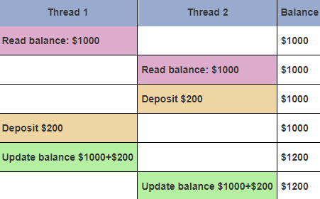

# POSIX thread (pthread.h library)
La libreria dei thread POSIX offre un'API standard per gestire i thread in C/C++. Consente di creare processi concorrenti in modo efficiente, soprattutto su sistemi multi-processore o multi-core. Rispetto alla creazione di nuovi processi, l'uso dei thread richiede meno risorse, permettendo un'esecuzione più veloce del software. I thread in questo caso condividono lo stesso spazio di memoria (memoria virtuale che viene allocata quando un programma viene eseguito e quindi viene generato un processo), a differenza di MPI in cui ogni thread ha il suo spazio di memoria privato in cui copiare le informazioni. Tuttavia, mentre i thread sono limitati a un singolo sistema informatico, le tecnologie di programmazione parallela come MPI e PVM sono utilizzate anche in ambienti di calcolo distribuito.

## Creazione/terminamento dei Thread e passaggio di argomenti
Quando viene generato un thread, questo viene fatto partire con l'assegnazione di una _thread function_ (una normale funziona che però è di tipo void* e ha un singolo parametro sempre void*), quando questa termina (_return_), anche il thread termina. Ogni thread assegnato ad un processo viene riconosciuto tramite _thread ID_ che può essere richiamato nel codice dichiarando il tipo **pthread_t**.

Iniziamo creando un semplice thread che stampa la scritta HelloWord. Prima di tutto creiamo un file con estensione " .c " che include la libreria **pthread.h** e che andremo successivamente a compilare con il comando `gcc -pthread myhello.c -o hello` (supponendo di star utilizzando il compilatore _gcc_):

```c
#include <stdio.h>
#include <stdlib.h>
#include <pthread.h>

void *print_message_function( void *ptr );

main()
{
     pthread_t thread;
     char *message = "Hello World!";
     int  iret

     iret = pthread_create(&threadID, NULL, print_message_function, (void*) message);

     pthread_join(thread, NULL);

     printf("Thread returns: %d\n", iret);
     exit(0);
}

void *print_message_function( void *ptr )
{
     char *message;
     message = (char *) ptr;
     printf("%s \n", message);
}
```

Nell'ordine abbiamo dichiarato un thread ID, un puntatore a char che rappresenterà il messaggio e un intero che ci verrà successivamente restituito dalla funzione _pthread_create_, questa restituirà il codice 0 se l'esecuzione del thread è andata a buon fine e un codice diverso da 0 se ci sono stati errori durante la creazione o l'esecuzione dello stesso.

**pthread_join** viene utilizzata per aspettare la terminazione di un thread specifico. Quando un thread principale (o un altro thread) chiama pthread_join su un thread "figlio", il thread chiamante attende fino a quando il thread "figlio" specificato termina la sua esecuzione. Questa funzione accetta due parametri: l'identificatore del thread da attendere e un puntatore che riceverà il valore di ritorno del thread terminato, se ce n'è uno. Il valore di ritorno può essere impostato con la funzione **pthread_exit**, questa viene utilizzata per terminare il thread corrente in modo esplicito, restituendo un valore opzionale. Quando un thread chiama _pthread_exit_, termina immediatamente la sua esecuzione e restituisce il valore specificato. Il sistema operativo libera automaticamente le risorse associate al thread (come la memoria) una volta che è terminato.

Vediamo un esempio più esteso:
```c
#include <pthread.h>
#include <stdio.h>
#define NUM_THREADS 5

void *PrintHello(void *threadid)
{
   long tid;
   tid = (long)threadid;
   printf("It's me, thread #%ld!\n", tid);
   pthread_exit(NULL);
}

int main (int argc, char *argv[])
{
   pthread_t threads[NUM_THREADS];
   int iret;
   long t;

   for(t = 0; t < NUM_THREADS; t++) {
      printf("In main: creating thread %ld\n", t);
      iret = pthread_create(&threads[t], NULL, PrintHello, (void *)t);
      if (iret) {
         printf("ERROR; return code from pthread_create() is %d\n", iret);
         exit(-1);
      }
   }
   
   pthread_exit(NULL);
}
```
In questo caso andiamo a generare più thread dichiarando un array di _NUM_THREADS_ elementi a cui successivamene assegniamo una funzione per stampare la propria posizione in lista. In questo caso utilizzare o meno la funzione _pthread_exit_ non altera il comportamento del codice (vediamolo come una return ma riferito allo stato del thread!).

Abbiamo quindi visto come il metodo _pthread_create()_ consente a noi sviluppatori di passare un singolo argomento al thread generato (nel nostro caso il messaggio da stampare). Come facciamo se vogliamo passarne più di uno? Possiamo bypassare questa cosa creando una struttura contenente tutti i nostri argomenti e passarla alla funzione tramite puntatore:
```c
// Come viene creata la struttura.
struct thread_data{
   int  thread_id;
   int  sum;
   char *message;
};

struct thread_data thread_data_array[NUM_THREADS];

void *PrintHello(void *threadarg)
{
    // Come passare ed estrapolare le informazioni dalla struttura.
   struct thread_data *my_data;
   ...
   my_data = (struct thread_data *) threadarg;
   taskid = my_data->thread_id;
   sum = my_data->sum;
   hello_msg = my_data->message;
   ...
}

int main (int argc, char *argv[])
{
    // Suppondiamo di aver creato un array di thread_data e ad ciclo lo riempiamo con le nostre info.
   ...
   thread_data_array[t].thread_id = t;
   thread_data_array[t].sum = sum;
   thread_data_array[t].message = messages[t];
   iret = pthread_create(&threads[t], NULL, PrintHello, (void *) &thread_data_array[t]);
   ...
}
```
## Unione e distacco dei Threads (funzioni _join_ e _detach_)
Quando un programma viene eseguito, automaticamente viene generato un processo assegnato ad un *Master Thread*, questo può creare a sua volta altri thread per la distribuzione parallela del carico di lavoro. A loro volta questi thread "figli" possono avviare altri thread formando una struttura ad albero. La gestione di tutti questi thread avviene mediante sincronizzazione. Tra i metodi utilizzati per sincronizzare i POSIX threads ci sono il **join** (che vedremo tra poco), **mutex** e **variabili di condizione** (che vedremo in seguito).


Questa è la routine di sincronizzazione che avviene con l'utilizzo dei metodi _create_/_join_/_exit_. La funzione **pthread_join()** blocca il thread chiamante finché non termina il thread specificato (in questo caso metterà in pausa il Master Thread fin quanto i worker threads non avreanno terminato la loro esecuzione). Tramite la funzione **pthread_exit()** è possibile termianare i worker threads e consentire al programmatore mediante codici di errore di gestire il proseguo del programma (solitamente se la funzione exit ritorna come codice di ritorno _zero_, il Master Thread può continuare la normale esecuzione del programma).

La funzione **pthread_detach()**, invece, può essere banalmente utilizzata per scollegare esplicitamente un thread anche se è stato creato come unibile (di base tutti quelli creati come nei precedenti esempi sono unibili).

Vediamo un esempio sull'utilizzo del _join_ (sembra difficile ma non è nulla di diverso da quello che abbiamo già visto!):

```c
#include <pthread.h>
#include <stdio.h>
#include <stdlib.h>
#include <math.h>

// Definiamo il numero di thread
#define NUM_THREADS	4

// Implementiamo una fuzione complessa (non ci interessa il contento)
void *BusyWork(void *t)
{
   int i;
   long tid;
   double result = 0.0;
   tid = (long)t;
   printf("Thread %ld starting...\n",tid);
   for (i=0; i<1000000; i++)
   {
      result = result + sin(i) * tan(i);
   }
   printf("Thread %ld done. Result = %e\n", tid, result);
   pthread_exit((void*) t);
}

int main (int argc, char *argv[])
{
   pthread_t thread[NUM_THREADS];
   pthread_attr_t attr;
   int rc;
   long t;
   void *status;

   // In questo modo inizializziamo i futuri thread come joinabili (di default già lo sono).
   // Nota che per tutti i precedenti esercizi il paramentro &attr era NULL. Ora gli diamo un senso!
   pthread_attr_init(&attr);
   pthread_attr_setdetachstate(&attr, PTHREAD_CREATE_JOINABLE);

   // Creiamo e controlliamo lo status code sulla creazione di ogni thread.
   for(t = 0; t < NUM_THREADS; t++) {
      printf("Main: creating thread %ld\n", t);
      rc = pthread_create(&thread[t], &attr, BusyWork, (void *)t);
      if (rc) {
         printf("ERROR; return code from pthread_create() is %d\n", rc);
         exit(-1);
      }
   }

   // Attendiamo e controlliamo lo status code sulla terminazione di ogni thread.
   pthread_attr_destroy(&attr);
   for(t=0; t<NUM_THREADS; t++) {
      rc = pthread_join(thread[t], &status);
      if (rc) {
         printf("ERROR; return code from pthread_join() is %d\n", rc);
         exit(-1);
      }
      printf("Main: completed join with thread %ld having a status
             of %ld\n",t,(long)status);
   }

   printf("Main: program completed. Exiting.\n");
   pthread_exit(NULL);
}
```

Per riassumere, la sincronizzazione dei thread è un processo spesso obbligatorio in quanto, introducendo il parallelismo, l'ordine di esecuzione del codice non è riga per riga come appare su schermo (e come avviene nel codice sequenziale), ma può variare in quanto l'ordine in cui creiamo i thread non è sempre quello in cui vengono avviati (oltre al fatto che potrebbero avere velocità diverse). Questo può portare ad un problema di **race condition**, ossia quella condizione in cui i thread fanno "gara" per terminare ma ciò avviene in tempi e ordini differenti e potrebbero restituire risulati inaspettati.

## Variabili Mutex
Un problema correlato riguarda l'utilizzo di variabili uniche globali/costanti a cui i thread potrebbero accedere e leggere/modificare scorrettamente. A tal proposito vengono utilizzate le variabili **Mutex** (_mutua esclusione_), che fungono da blocco su quelle variabili condivise a cui più thread potrebbero accedere e modificare.\
Di base SOLO un thread per volta in POSIX può "lockare" una variabile mutex in un dato momento per poi rilasciarla agl'altri thread quando ha terminato la sua operazione, questo aiuterà a risolvere i problemi di race condition. Supponendo infatti di non avere blocchi su variabili importanti condivise, questo è quello che potrebbe succedere:



In questo caso la variabile _balance_ è una variabile globale a cui due thread hanno fatto accesso e "gara" per completare le loro operazioni, il risultato è che entrambi avendo letto 1000 come valore iniziare non erano a conoscenza delle modifiche fatte da altri thread, quindi a fine operazione solo un deposito di un thread sarà stato salvato correttamente.

Nel caso di thread a memoria NON condivisa invece (come con MPI), i thread riescono a comunicare mediante messaggi, quindi se un thread ha apportato una modifica, tutti gli altri possono "vedere" quella modifica e aggiornare il valore nella loro memoria locale.

### Creazione, distruzione, lock e unlock di una variabile Mutex
Una variabile Mutex deve essere dichiarata come `pthread_mutex_t nome_variabile`, inizializzata con la funzione `pthread_mutex_init(&nome_variabile, NULL)` e distrutta (nel caso in cui non sia più necessaria) con la funzione `pthread_mutex_destroy(&nome_variabile)`. POSIX consente di specificare altri attributi durante l'inizializzazione di un Mutex, per lasciarli di default basta lasciare il NULL come nell'esempio.

Una volta inizializzata una variabile Mutex, se ancora libera, potrà essere bloccata e lavorata da uno generico thread con la chiamata `pthread_mutex_lock(&nome_variabile)` per poi essere rilasciata con la chiamata `pthread_mutex_unlock(&nome_variabile)`.

E' importante notare che nel caso in cui una variabile mutex fosse già stata presa da un altro thread, chiamando `pthread_mutex_lock(&nome_variabile)`, tutti gli altri thread "perdenti" resterebbero bloccati fin quando quest'ultima non venga rilasciata. Per evitare questa situazione di **deadlock**, è possibile usare un "trylock" con `pthread_mutex_trylock(&nome_variabile)`. In questo modo se un thread provasse ad occupare una variabile Mutex già occupata, invece di bloccarsi inutilmente, restituirebbe un codice di errore per poi continuare con altre operazioni.

**DOMANDA:** Supponendo di avere più thread che stanno concorrendo per un lock sulla stessa variabile, questa a chi verrebbe concessa per prima? In realtà questo avviene casualmente a meno che non ci sia una priorità impostata (uno degli attribuiti che andrebbe al posto del NULL durante l'inizializzazione della variabile Mutex).

Vediamo ora un esempio di un programma per fare il prodotto scalare. In questo caso il thread master dà vita ad altri thread figli, ognuno dei quali lavora su una porzione diversa di dato, attende la loro esecuzione e stampa il risultato finale:

```c
#include <pthread.h>
#include <stdio.h>
#include <stdlib.h>

// Creiamo una nuova struttura contenente 4 variabili che inizializzeremo in seguito con la variabile "dotstr" e che verrà usata dalla funzione "dotprod".
typedef struct
{
   double *a;
   double *b;
   double sum;
   int    veclen;
} DOTDATA;

// Definiamo delle variabili globali e una mutex sulla somma finale.
#define NUMTHRDS 4
#define VECLEN 100

DOTDATA dotstr;
pthread_t callThd[NUMTHRDS];
pthread_mutex_t mutexsum;


// Questa è la funzione che si occupa di calcolare il prodotto scalare.
// Questa verrà attivata quando un thread viene inizializzato e prende in input come paramentro l'ID del thread stesso (utilizzato per assegnare al thread una specifica porzione di dato e quindi suddividere il lavoro tra tutti i thread disponibili!)
// Tutto quello di cui necessita la funzione lo può trovare nella struttura, l'unica cosa di cui si deve preoccupare e assicurarsi che un thread faccia la lock sulla variabile "mutexsum" prima che ci lavori. Questa infatti è l'unica variabile su cui più thread possono scrivere ed è quindi importante che venga bloccata prima di essere modificata.
void *dotprod(void *arg)
{
   
   int i, start, end, len;
   long offset;
   double mysum, *x, *y;
   offset = (long)arg;

   len = dotstr.veclen;
   start = offset * len;
   end   = start + len;
   x = dotstr.a;
   y = dotstr.b;


   mysum = 0;
   for (i = start; i < end ; i++) {
      mysum += (x[i] * y[i]);
   }


   pthread_mutex_lock(&mutexsum);
   dotstr.sum += mysum;
   pthread_mutex_unlock(&mutexsum);

   pthread_exit((void*) 0);
}


// Il main si occupa solamente di inizializzare la struttura e i thread e attendere che finiscano per stampare il risultato finale.
int main (int argc, char *argv[])
{
   long i;
   double *a, *b;
   void *status;
   pthread_attr_t attr;

   // in questo modo vengono inizializzate le variabili a e b a cui viene assegnato uno specifico storage in base al numero di threads.
   a = (double*) malloc (NUMTHRDS * VECLEN * sizeof(double));
   b = (double*) malloc (NUMTHRDS * VECLEN * sizeof(double));

   for (i = 0; i < VECLEN * NUMTHRDS; i++) {
      a[i] = 1.0;
      b[i] = a[i];
   }

   dotstr.veclen = VECLEN;
   dotstr.a = a;
   dotstr.b = b;
   dotstr.sum = 0;

   pthread_mutex_init(&mutexsum, NULL);


   pthread_attr_init(&attr);
   pthread_attr_setdetachstate(&attr, PTHREAD_CREATE_JOINABLE);

   for(i = 0; i < NUMTHRDS; i++) {
      // Ogni thread funziona su un diverso set di dati. L'offset è specificato da 'i'. La dimensione dei dati per ciascun thread è indicato invece da VECLEN.
      pthread_create(&callThd[i], &attr, dotprod, (void *)i);
   }

   pthread_attr_destroy(&attr);

   // Si attende che tutti i thread finiscano
   for(i = 0; i < NUMTHRDS; i++) {
      pthread_join(callThd[i], &status);
   }

   // Dopo il join di tutti i thread è possibile finalmente stampare il risultato
   printf("Sum =  %f\n", dotstr.sum);
   free(a);
   free(b);
   pthread_mutex_destroy(&mutexsum);
   pthread_exit(NULL);
}
```

## Variabili di condizione
Un modo più efficente per la gestione della sincronizzazione dei thread, che solitamente va in combinazione con le variabili Mutex, è quello dell'utilizzo delle **variabili di condizione**.

Mentre i Mutex implementano la sincronizzazione controllando l'**accesso dei thread ai dati**, le variabili di condizione consentono ai thread di sincronizzarsi in base al **valore effettivo dei dati** (vedremo a breve in che senso).

Abbiamo già visto come, usando solo delle variabili Mutex, se più thread cercassero di lockare una variabile, solo uno di questi ne uscirebbe vincitore, tutti gli altri invece continuerebbero a sfidarsi per aggiudicarsi la successiva posizione. Senza variabili di condizione, ci sarebbe un continuo spreco di risorse di thread che resterebbero quindi bloccati in questa attività.

Vediamo un esempio rappresentativo di un programma parallelo che sfrutta le variabili di condizione affiancate a quelle Mutex:
1. Viene generato un **processo** assegnato ad un Master Thread;
2. Il **Master Thread** dichiara e inizializza le variabili globali che richiedono la sincronizzazione (ad esempio un count o una somma), una o più variabili di condizione e variabili Mutex associate. Infine crea e inizializza i due thread A e B.
3. Il **thread A** esegue il suo lavoro fin quando non arriva ad una certa condizione che si deve verificare (ad esempio deve attendere che un contatore arrivi ad una certa soglia). Si mette quindi in attesa ,rilasciando il mutex che potrà essere utilizzato dal thread B e aspettando un suo segnale questo avrà terminato il suo lavoro.
4. Il **thread B** blocca quindi la variabile Mutex, fa il suo lavoro, cambia il valore della variabile globale per cui il thread A stava aspettando (la condizione da verificare) e controlla se la condizione si è verificata, se si segnala il thread A (lo risveglia) e sblocca il Mutex che verrà occupato da A.
5. Il **Master Thread** attende che tutti i thread figli finiscano il loro lavoro (con il join), per poi procedere con altre istruzioni o terminando il programma.

In sostanza le variabili di condizione vengono utilizzate per consentire ai thread di attendere determinate condizioni prima di procedere. In genere, vengono utilizzate in combinazione con un mutex. Un thread può mettersi in attesa su una variabile di condizione (rilevando che la condizione desiderata non è soddisfatta) e rilasciare il mutex associato. Altri thread possono agire su quella condizione, modificando le risorse condivise e segnalando alla variabile di condizione quando la condizione desiderata è stata raggiunta. Successivamente, il thread in attesa può essere risvegliato e acquisire nuovamente il mutex per procedere.

L'uso delle variabili di condizione in combinazione con i mutex può essere vantaggioso perché consente ai thread di aspettare attivamente (senza consumare risorse della CPU) fino a quando una determinata condizione è soddisfatta. Invece di eseguire continui controlli per verificare se la condizione è stata soddisfatta, un thread può mettersi in attesa sulla variabile di condizione, lasciando il mutex libero per altri thread fino a quando la condizione non si verifica. Questo riduce l'uso della CPU e migliora l'efficienza complessiva del programma.

### Creazione e distruzione di variabili condizionali
Molto simile a quelle Mutex. Abbiamo `pthread_cond_t nome_variabile` per dichiarare una variabile di condizione, `pthread_cond_init(&nome_variabile, NULL)` per inizializzarla e `pthread_cond_destroy(&nome_variabile)` per distruggerla. Anche in questo caso, al posto del NULL è possibile aggiungere dei parametri aggiuntivi (NULL per lasciarli di default).

### Condizioni di attesa e risveglio
Con `pthread_cond_wait(&nome_variabile_condizionale, &nome_variabile_mutex)`, blocchiamo il thread chiamante fin quando la condizione specificata non è verificata (ed è verificata se viene segnalata dall'altro thread). Viene chiamata la wait se abbiamo già lockato la mutex, quindi la rilasciamo per "passare la palla" ad un altro thread che si occupa di raggiungere quella condizione e attendiamo un suo segnale.

> **NOTA** Così come avviene nel corso di Sistemi Operativi, anche in questo caso per mettere in wait un thread bisogna inserire la chiamata in un ciclo While.

Con `pthread_cond_signal(&nome_variabile_condizionale)` segnaliamo e quindi svegliamo i thread in attesa su quella condizione. A questa chiamata deve seguire quella dell'unlock sulla variabile Mutex!

Con `pthread_cond_broadcast(&nome_variabile_condizionale)` facciamo essenzialmente la stessa cosa della precedente, ma si usa nel caso in cui più thread sono in attesa della condizione. Quindi inviamo il segnale non ad uno specifico thread ma, per l'appunto, in broadcast.

A seguire un esempio pratico sull'utilizzo delle variabili condizionali e delle variabili mutex applicate ad un contatore:

```c
#include <pthread.h>
#include <stdio.h>
#include <stdlib.h>

#define NUM_THREADS  3
#define TCOUNT 10
#define COUNT_LIMIT 12

int count = 0;
pthread_mutex_t count_mutex;
pthread_cond_t count_threshold_cv;

void *inc_count(void *t)
{
  int i;
  long my_id = (long)t;

  for (i = 0; i < TCOUNT; i++) {
    pthread_mutex_lock(&count_mutex);
    count++;

   // Qui controllo se il contatore ha raggiunto il limite e in caso sblocco (segnalo) i thread in attesa.
   // NOTA! Ovviamente a questo punto avremo il lock sul mutex, perchè obbligatoriamente dopo un signal segue un unlock della variabile Mutex. 
    if (count == COUNT_LIMIT) {
      printf("inc_count(): thread %ld, count = %d -- threshold reached.", my_id, count);
      pthread_cond_signal(&count_threshold_cv);
      printf("Just sent signal.\n");
    }
    printf("inc_count(): thread %ld, count = %d -- unlocking mutex\n",
           my_id, count);
    pthread_mutex_unlock(&count_mutex);

    // Lo sleep serve giusto a rallentare i thread come se stessero facendo del lavoro.
    sleep(1);
  }
  pthread_exit(NULL);
}

void *watch_count(void *t)
{
  long my_id = (long)t;

  printf("Starting watch_count(): thread %ld\n", my_id);

  // Solo nel caso in cui count < COUNT_LIMIT ci mettiamo in wait attendendo il segnale.
  // NOTA! se mai dovessiamo chiamare il wait, dobbiamo prima aver lockato la variabile Mutex, inoltre il wait internamente chiamerà l'unlock della variabile Mutex (Nel caso del signal invece è resposabilità del programmatore richiamare a mano l'unlock!).
  pthread_mutex_lock(&count_mutex);
  while (count < COUNT_LIMIT) {
    printf("watch_count(): thread %ld Count= %d. Going into wait...\n", my_id, count);
    pthread_cond_wait(&count_threshold_cv, &count_mutex);
    printf("watch_count(): thread %ld Condition signal received. Count= %d\n", my_id, count);
  }
  printf("watch_count(): thread %ld Updating the value of count...\n", my_id);
  count += 125;
  printf("watch_count(): thread %ld count now = %d.\n", my_id, count);
  printf("watch_count(): thread %ld Unlocking mutex.\n", my_id);
  pthread_mutex_unlock(&count_mutex);
  pthread_exit(NULL);
}

int main(int argc, char *argv[])
{
  int i, rc;
  long t1 = 1,
       t2 = 2,
       t3 = 3;
  pthread_t threads[3];
  pthread_attr_t attr;

  // Inizializziamo il mutex e la condizionale.
  pthread_mutex_init(&count_mutex, NULL);
  pthread_cond_init (&count_threshold_cv, NULL);

  // Creiamo dei thread joinabili (anche se già di default lo sono).
  pthread_attr_init(&attr);
  pthread_attr_setdetachstate(&attr, PTHREAD_CREATE_JOINABLE);
  pthread_create(&threads[0], &attr, watch_count, (void *)t1);
  pthread_create(&threads[1], &attr, inc_count, (void *)t2);
  pthread_create(&threads[2], &attr, inc_count, (void *)t3);

  // Mettiamo in attesa il Master Thread che aspetterà che tutti i thread figli terminino.
  for (i = 0; i < NUM_THREADS; i++) {
    pthread_join(threads[i], NULL);
  }
  printf ("Main(): Waited and joined with %d threads. Final value of count = %d. Done.\n",
          NUM_THREADS, count);

  // Ripuliamo con la destroy e terminiamo il programma parallelo.
  pthread_attr_destroy(&attr);
  pthread_mutex_destroy(&count_mutex);
  pthread_cond_destroy(&count_threshold_cv);
  pthread_exit (NULL);
```

## Per concludere...
Arrivati a questo punto abbiamo visto ogni metodo per prevenire sprechi computazionali e gestire al meglio l'armonia tra i thread. La libreria _POSIX_ applicata ad un singolo sistema per cui è possibile la condivisione di memoria, è un ottimo metodo per sfruttare tutta la potenza computazionale di un microprocessore e quindi ottimizzare i tempi di esecuzione del nostro programma.

Un approccio ben più differente ma ancora più performante è la libreria MPI che, con il suo approccio alla memoria distribuita, consente di implementare una rete di sistemi (da qui sistemi distribuiti) che comunicano tra loro mediante un sistema di messaggistica.